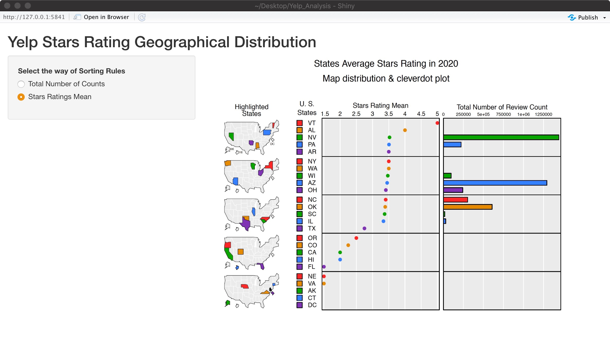

# Interactive component

## Shiny App: Word Cloud for Yelp Key Words ##

We initially deployed our interactive plots to https://edavyelpanalysis.shinyapps.io/edav_wordcloud/ but later encountered technical issues with the server. So we aslo screen shot our images in the following.

```{r echo=FALSE, include=FALSE}
library(wordcloud)
library(tidyverse)
library(tidytext)
library(shiny)
yelp_clean_data <- read.csv("yelp_cleaned_data.csv")
yelp_clean_data2 <- yelp_clean_data
```

```{r echo=FALSE, include=FALSE}
yelp_clean_data2$american <- ifelse(str_detect(yelp_clean_data2$country,"american"),1,0)
yelp_clean_data2$mexican <- ifelse(str_detect(yelp_clean_data2$country,"mexican"),1,0)
yelp_clean_data2$italian <- ifelse(str_detect(yelp_clean_data2$country,"italian"),1,0)
yelp_clean_data2$chinese <- ifelse(str_detect(yelp_clean_data2$country,"chinese"),1,0)
yelp_clean_data2$japanese <- ifelse(str_detect(yelp_clean_data2$country,"japanese"),1,0)
yelp_clean_data2$middleeastern <- ifelse(str_detect(yelp_clean_data2$country,"middleeastern"),1,0)
yelp_clean_data2$french <- ifelse(str_detect(yelp_clean_data2$country,"french"),1,0)
yelp_clean_data2$korean <- ifelse(str_detect(yelp_clean_data2$country,"korean"),1,0)
yelp_clean_data2$spanish <- ifelse(str_detect(yelp_clean_data2$country,"spanish"),1,0)
yelp_clean_data2$thai <- ifelse(str_detect(yelp_clean_data2$country,"thai"),1,0)
yelp_clean_data2$greek <- ifelse(str_detect(yelp_clean_data2$country,"greek"),1,0)
yelp_clean_data2$canadian <- ifelse(str_detect(yelp_clean_data2$country,"canadian"),1,0)
yelp_clean_data2$vietnamese <- ifelse(str_detect(yelp_clean_data2$country,"vietnamese"),1,0)
```


```{r echo=FALSE, include=FALSE}
newdata1 <- yelp_clean_data2[,41:72]
yelp_tidy <- gather(data = newdata1, key = "category", value = "value", 1:32)
yelp_tidy = yelp_tidy[yelp_tidy$value==1,]
yelp_tidy <- na.omit(yelp_tidy)
```

```{r include=FALSE}
#ui  <- fluidPage(
#  titlePanel('Shiny App: Word Cloud for Yelp Key Words'),
#  sidebarLayout(
#    sidebarPanel(
#      sliderInput('ngramCount', 'Number of Grams', min = 1, max = 5, value = 1),
#      sliderInput("freq",
#                  "Minimum Frequency:",
#                  min = 1,  max = 30, value = 15), hr(),
#     sliderInput("max",
#                  "Maximum Number of Words:", min = 4, max = 32, value = 10)
#    ),
#    mainPanel(
#      plotOutput('wordcloud') 
#    )
#  )
#)
#server  <- function(input, output) {
#  ngrams  <- reactive({
#    input$ngramCount
#  })
# output$wordcloud  <- renderPlot({
#      yelp_tidy %>%
#      select(category) %>%
#      unnest_tokens(ngram, category, token="ngrams", n=ngrams()) %>%
#      count(ngram) %>%
#      with(wordcloud(ngram, n, min.freq = input$freq, max.words=input$max, rot.per=0.2, colors=c("#b4b3b3", "#969696", "#484848", "#8dc7d3")))
# })
#}
#shinyApp(ui, server)
```


```{r include=FALSE}
#ui  <-  fluidPage(
#  titlePanel("Yelp Stars Rating Geographical Distribution"),
  
#  fluidRow(
#    column(4, wellPanel(
#      radioButtons("picture", "Select the way of Sorting Rules",
#                   c("Total Number of Counts", "Stars Ratings Mean"))
#    )),
#    column(4,
#           imageOutput("image2")
#    )
#  )
#)
#server <- shinyServer(
#function(input, output, session) {
#  output$image2 <- renderImage({
#    if (is.null(input$picture))
#      return(NULL)
    
#    if (input$picture == "Total Number of Counts") {
#      return(list(
#        src = "images/2.png",
#        width = 700,
#        height = 500,
#        alt = ""
#      ))
#   } else if (input$picture == "Stars Ratings Mean") {
#      return(list(
#        src = "images/1.png",
#        width = 700,
#        height = 500,
#        alt = ""
#      ))
#    }
# }, deleteFile = FALSE)
#}
#)
#shinyApp(ui, server)
```


This Shiny App serves as an extension to our previous Word-Vector analysis of the restaurant category and country style. Once the word vector has been built, anyone can adjust the input limitation (like: minimum frequency and max number of words) and build a word-cloud. User can slide the bar and set the “max words” and "min frequency" in the word cloud. A valid query word would be one that is present in the corpus, else it wouldn’t be part of the word vector. It is easy to think of such words; It help the user to interact with the word cloud generation. 


## Shiny App: Change the Sorting Method for Rating Distribution ##




In addition to directly using pdf or pictures to display Ratings distribution under different sorting methods, we can use shiny app to adopt a interactive way of switching the sorting method. By clicking the radio button, we can alter the choice of sorting method, and compare the result much more directly. In main panel, we inserted the micromap result as images that is linked to different choices.
